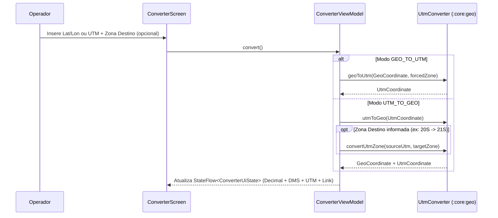
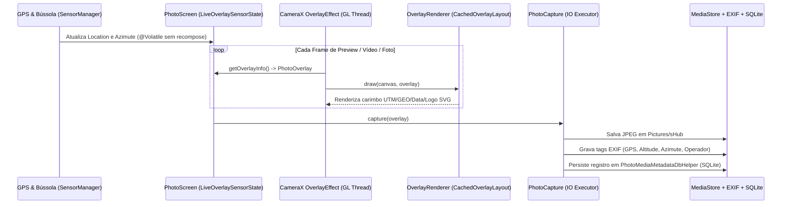
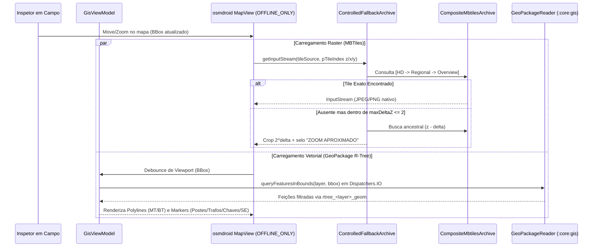

# Fluxo de Dados — sHub

**Data:** 2026-11-06

---

## 1. Fluxo Geodésico (`sGeoConversor`)

```mermaid
sequenceDiagram
    participant User as Operador
    participant UI as ConverterScreen
    participant VM as ConverterViewModel
    participant Geo as UtmConverter (:core:geo)

    User->>UI: Insere Lat/Lon ou UTM + Zona Destino (opcional)
    UI->>VM: convert()
    alt Modo GEO_TO_UTM
        VM->>Geo: geoToUtm(GeoCoordinate, forcedZone)
        Geo-->>VM: UtmCoordinate
    else Modo UTM_TO_GEO
        VM->>Geo: utmToGeo(UtmCoordinate)
        opt Zona Destino informada (ex: 20S -> 21S)
            VM->>Geo: convertUtmZone(sourceUtm, targetZone)
        end
        Geo-->>VM: GeoCoordinate + UtmCoordinate
    end
    VM-->>UI: Atualiza StateFlow<ConverterUiState> (Decimal + DMS + UTM + Link)
```

---

## 2. Fluxo de Captura e Estampagem (`sFoto`)

```mermaid
sequenceDiagram
    participant Sensors as GPS & Bússola (SensorManager)
    participant Screen as PhotoScreen (LiveOverlaySensorState)
    participant Effect as CameraX OverlayEffect (GL Thread)
    participant Renderer as OverlayRenderer (CachedOverlayLayout)
    participant Capture as PhotoCapture (IO Executor)
    participant Storage as MediaStore + EXIF + SQLite

    Sensors->>Screen: Atualiza Location e Azimute (@Volatile sem recompose)
    loop Cada Frame de Preview / Vídeo / Foto
        Effect->>Screen: getOverlayInfo() -> PhotoOverlay
        Effect->>Renderer: draw(canvas, overlay)
        Renderer-->>Effect: Renderiza carimbo UTM/GEO/Data/Logo SVG
    end
    Screen->>Capture: capture(overlay)
    Capture->>Storage: Salva JPEG em Pictures/sHub
    Capture->>Storage: Grava tags EXIF (GPS, Altitude, Azimute, Operador)
    Capture->>Storage: Persiste registro em PhotoMediaMetadataDbHelper (SQLite)
```

---

## 3. Fluxo Cartográfico Offline (`sGis`)

```mermaid
sequenceDiagram
    participant User as Inspetor em Campo
    participant GisVM as GisViewModel
    participant Map as osmdroid MapView (OFFLINE_ONLY)
    participant Fallback as ControlledFallbackArchive
    participant Composite as CompositeMbtilesArchive
    participant Gpkg as GeoPackageReader (:core:gis)

    User->>Map: Move/Zoom no mapa (BBox atualizado)
    par Carregamento Raster (MBTiles)
        Map->>Fallback: getInputStream(tileSource, pTileIndex z/x/y)
        Fallback->>Composite: Consulta [HD -> Regional -> Overview]
        alt Tile Exato Encontrado
            Composite-->>Map: InputStream (JPEG/PNG nativo)
        else Ausente mas dentro de maxDeltaZ <= 2
            Fallback->>Composite: Busca ancestral (z - delta)
            Fallback-->>Map: Crop 2^delta + selo "ZOOM APROXIMADO"
        end
    and Carregamento Vetorial (GeoPackage R-Tree)
        Map->>GisVM: Debounce de Viewport (BBox)
        GisVM->>Gpkg: queryFeaturesInBounds(layer, bbox) em Dispatchers.IO
        Gpkg-->>GisVM: Feições filtradas via rtree_<layer>_geom
        GisVM-->>Map: Renderiza Polylines (MT/BT) e Markers (Postes/Trafos/Chaves/SE)
    end
```

